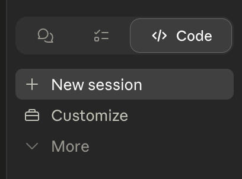
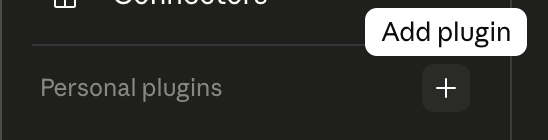
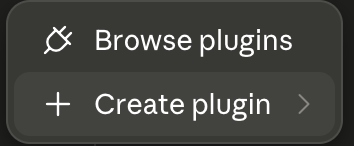
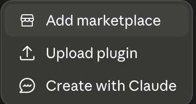
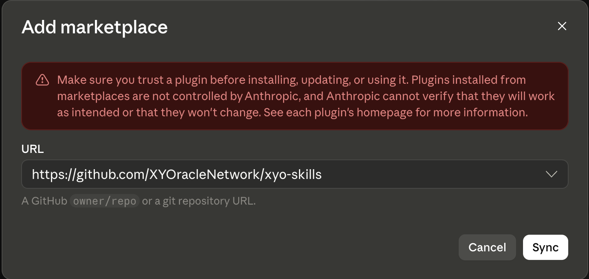
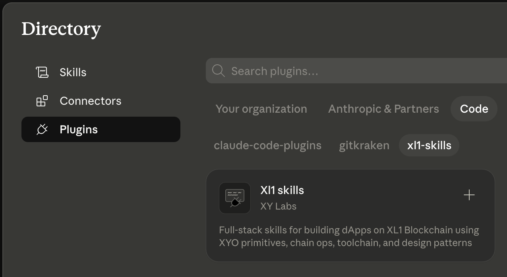

# XYO Skills

XL1 / XYO development skills for AI coding assistants. The same skill content is published to agent skill marketplaces and to [Skills.sh](https://skills.sh), so you can install it whichever way fits your workflow.

## What's Included

Six skill layers that cascade top-down:

| Layer | Skill | Covers |
|-------|-------|--------|
| 6 | `xl1-scaffold` | Bootstrap new XL1 apps (React dApp, Node service, monorepo) |
| 5 | `xl1-patterns` | Commit-reveal, chain data indexing, in-page datalakes, prediction markets |
| 4 | `xl1-knowledge` | XL1 chain, datalakes, gateway, browser wallet |
| 3 | `xyo-knowledge` | XYO payloads, bound witnesses, modules, identity |
| 2 | `xy-toolchain` | @xylabs/toolchain, ESLint flat config, TypeScript config, Vitest |
| 1 | `xy-development` | TypeScript, Git workflow, testing, dev conventions |

Skills use progressive loading — each `SKILL.md` is a lightweight router that directs the agent to read sub-files on demand based on task context.

## How These Work in Multiple Places

Agent skills are just Markdown files with YAML frontmatter (`name`, `description`). That format is portable across the major coding agents and skill registries, so this repo is a single source of truth — you're getting the *same* skills regardless of how you install them.

The Claude Code and Codex marketplaces require incompatible repository layouts, so each release renders marketplace-shaped trees into dedicated mirror repos. Install URLs point at the mirror for your tool; the source of the skills (and where to file issues or PRs) is always this repo:

| Install via | Repo to point at | Notes |
| --- | --- | --- |
| Claude Code marketplace | `XYOracleNetwork/xyo-skills-claude` | Mirror — written by release automation. |
| Codex marketplace | `XYOracleNetwork/xyo-skills-codex` | Mirror — written by release automation. |
| Skills.sh | `XYOracleNetwork/xyo-skills` | Source of truth. |

## Install

### Marketplaces

Browse and install through your coding agent's built-in skill marketplace.

#### Claude Code

##### Claude Code CLI

```shell
# Add the marketplace
/plugin marketplace add XYOracleNetwork/xyo-skills-claude

# Install the XL1 skill stack
/plugin install xyo-skills
```

##### Claude Desktop app

The `/plugin` slash commands aren't available in the Claude Code desktop app — use the **Customize** panel instead:

1. Click **Customize** in the left sidebar.

   

2. Under **Personal plugins**, click the **+** button.

   

3. Choose **+ Create plugin**.

   

4. Choose **Add marketplace**.

   

5. In the URL field, paste `https://github.com/XYOracleNetwork/xyo-skills-claude` and click **Sync**.

   

6. In the plugin directory that opens, click the **Code** tab in the top row, then the **xyo-skills** marketplace pill in the second row. Find **Xyo skills** and click the **+** to install.

   

##### Claude Team Setup

Add to your project's `.claude/settings.json` so the marketplace is auto-discovered for everyone on the team — works in both the CLI and the desktop app:

```json
{
  "extraKnownMarketplaces": {
    "xyo-skills": {
      "source": {
        "source": "github",
        "repo": "XYOracleNetwork/xyo-skills-claude"
      }
    }
  }
}
```

Each team member then installs the plugin through their preferred interface (CLI or desktop app) using the steps above.

#### OpenAI Codex

##### Codex CLI

```shell
# Add the marketplace
codex plugin marketplace add XYOracleNetwork/xyo-skills-codex --ref main

# Install the XL1 skill stack
codex plugin add xyo-skills@xyo-skills
```

After installing or updating the plugin, start a new Codex thread so the skill list is refreshed.

##### Local checkout

For development against a local clone of *this* repo, render the Codex tree and register it as a local marketplace — see [DEVELOPMENT.md](./DEVELOPMENT.md#codex) for details.

### Skills.sh

[Skills.sh](https://skills.sh) is an open-source CLI from Vercel that installs agent skills into any of 50+ supported coding agents — including Claude Code, Cursor, Codex, OpenCode, Gemini CLI, and more. Use this route if your agent isn't on a marketplace, if you want a single command to install across multiple agents at once, or if you want skills installed globally on your machine.

#### Prerequisites

- **Node.js** (latest LTS recommended — download from [nodejs.org](https://nodejs.org))
- `npx` ships with Node.js, so no separate install is needed.

#### Per-project install

Run from the root of your project. Skills are written into your agent's project-local folder (e.g. `.claude/skills/` for Claude Code), which you can commit alongside the project so anyone who clones it gets the same skills.

```shell
npx skills add XYOracleNetwork/xyo-skills --all
```

#### Global install

Installs into your home directory (e.g. `~/.claude/skills/`) so the skills are available across every project on your machine.

```shell
npx skills add XYOracleNetwork/xyo-skills --all -g
```

#### Platform notes

- **Windows:** Skills.sh defaults to symlinking, which on Windows requires either Developer Mode or running your terminal as Administrator. The easier fix is to add `--copy`, which copies files instead:

  ```shell
  npx skills add XYOracleNetwork/xyo-skills --all --copy
  ```

- **macOS / Linux:** Symlinks work out of the box — no extra setup needed.

#### Updating, removing, and listing

```shell
npx skills update              # update all installed skills
npx skills remove              # remove skills (interactive)
npx skills list                # show what's installed
```

Full CLI reference: [vercel-labs/skills](https://github.com/vercel-labs/skills).

## Contributing

For local development, editing skills, building the scaffold package, and the release process, see [DEVELOPMENT.md](./DEVELOPMENT.md).

## License

[LGPL-3.0-only](./LICENSE)
