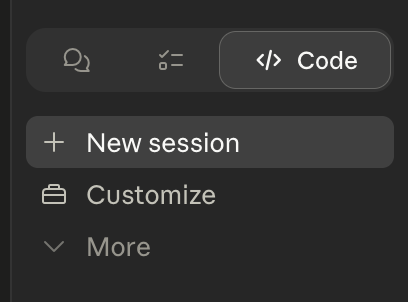
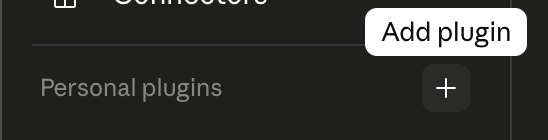
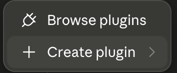
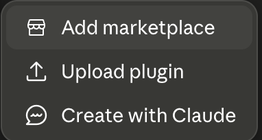
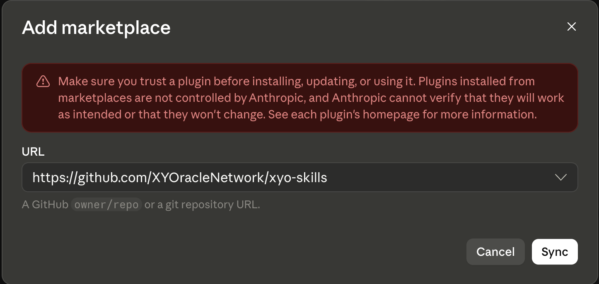
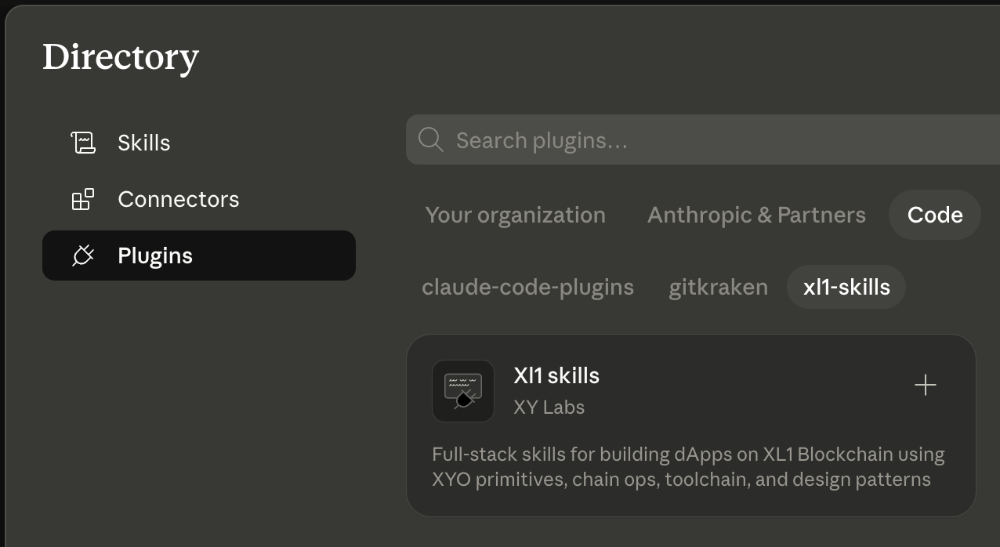

# XYO Skills

XL1 / XYO development skills for AI coding assistants. The same skill content is published to agent skill marketplaces and to [Skills.sh](https://skills.sh), so you can install it whichever way fits your workflow.

## What's Included

This pack owns the **XYO / XL1 domain layers**. Layers 1–2 (`xy-development`, `xy-toolchain`) are **not** authored here — install them from [`ariestools/ariestools-skills`](https://github.com/ariestools/ariestools-skills). Temporary redirect stubs under those names remain in this tree so older relative links still resolve; they are not documentation.

| Layer | Skill | Covers | Source |
|-------|-------|--------|--------|
| 9 | `xl1-build` | Planning wizard — refines a vague build request into a concrete dApp spec | this repo |
| 8 | `xl1-scaffold` | Bootstrap new XL1 apps (React dApp, xl1-service backend, Node service, monorepo) | this repo |
| 7 | `xl1-testing` | Local dev-chain, headless testnet verification, browser-mode tests, unattended wallet CLI | this repo |
| 6 | `xl1-dapp-kit` | Headless application contracts — `xl1.dapp.json`, ports, effects/recovery, hosting | this repo |
| 5 | `xl1-patterns` | Commit-reveal, indexing, inscriptions, Statement Graph, Event Kit wakes, tokens | this repo |
| 4 | `xl1-knowledge` | XL1 chain, datalakes, gateway (`FinalizedBlockStream`), browser wallet | this repo |
| 3 | `xyo-knowledge` | XYO payloads, bound witnesses, modules, identity | this repo |
| 2 | `xy-toolchain` | @ariestools/toolchain, ESLint, TypeScript config, Vitest | **[ariestools-skills](https://github.com/ariestools/ariestools-skills)** (redirect stub here) |
| 1 | `xy-development` | TypeScript, Git workflow, testing, definition of done | **[ariestools-skills](https://github.com/ariestools/ariestools-skills)** (redirect stub here) |

Skills use progressive loading — each `SKILL.md` is a lightweight router that directs the agent to read sub-files on demand based on task context.

**Required companion:** install **both** packs. In XY/XYO repos prefer `pnpm xy skills defaults`, which already pulls base skills from ariestools and domain skills from this repo.

## How These Work in Multiple Places

Agent skills are just Markdown files with YAML frontmatter (`name`, `description`). That format is portable across the major coding agents and skill registries. **This repo is the source of truth for XYO/XL1 domain skills**; base toolchain/development skills are sourced from ariestools-skills.

The Claude Code and Codex marketplaces require incompatible repository layouts, so each release renders marketplace-shaped trees into dedicated mirror repos. Install URLs point at the mirror for your tool; the source of the skills (and where to file issues or PRs) is always this repo:

| Install via | Repo to point at | Notes |
| --- | --- | --- |
| Claude Code marketplace | `XYOracleNetwork/xyo-claude-plugin` | Mirror — written by release automation. |
| Codex marketplace | `XYOracleNetwork/xyo-codex-plugin` | Mirror — written by release automation. |
| Skills.sh | `XYOracleNetwork/xyo-skills` | Source of truth. |

## Install

### Marketplaces

Browse and install through your coding agent's built-in skill marketplace.

#### Claude Code

##### Claude Code CLI

```shell
# Add marketplaces (base skills + XL1/XYO domain skills)
/plugin marketplace add ariestools/ariestools-claude-plugin
/plugin marketplace add XYOracleNetwork/xyo-claude-plugin

# Install both packs
/plugin install ariestools-skills
/plugin install xyo-skills
```

##### Claude Desktop app

The `/plugin` slash commands aren't available in the Claude Code desktop app — use the **Customize** panel instead:

1. Click **Customize** in the left sidebar.

   

2. Under **Personal plugins**, click the **+** button.

   

3. Choose **+ Create plugin**.

   

4. Choose **Add marketplace**.

   

5. In the URL field, paste `https://github.com/XYOracleNetwork/xyo-claude-plugin` and click **Sync**.

   

6. In the plugin directory that opens, click the **Code** tab in the top row, then the **xyo-skills** marketplace pill in the second row. Find **Xyo skills** and click the **+** to install.

   

##### Claude Team Setup

Add to your project's `.claude/settings.json` so the marketplace is auto-discovered for everyone on the team — works in both the CLI and the desktop app:

```json
{
  "extraKnownMarketplaces": {
    "ariestools-skills": {
      "source": {
        "source": "github",
        "repo": "ariestools/ariestools-claude-plugin"
      }
    },
    "xyo-skills": {
      "source": {
        "source": "github",
        "repo": "XYOracleNetwork/xyo-claude-plugin"
      }
    }
  }
}
```

Each team member then installs **both** plugins (`ariestools-skills` and `xyo-skills`) through their preferred interface (CLI or desktop app) using the steps above.

#### OpenAI Codex

##### Codex CLI

```shell
# Add marketplaces (base skills + XL1/XYO domain skills)
codex plugin marketplace add ariestools/ariestools-codex-plugin --ref main
codex plugin marketplace add XYOracleNetwork/xyo-codex-plugin --ref main

# Install both packs
codex plugin add ariestools-skills@ariestools-skills
codex plugin add xyo-skills@xyo-skills
```

After installing or updating the plugin, start a new Codex thread so the skill list is refreshed.

##### Local checkout

For development against a local clone of *this* repo, render the Codex tree and register it as a local marketplace — see [DEVELOPMENT.md](./DEVELOPMENT.md#codex) for details.

### Skills.sh

[Skills.sh](https://skills.sh) is an open-source CLI from Vercel that installs agent skills into any of 50+ supported coding agents — including Claude Code, Cursor, Codex, OpenCode, Gemini CLI, and more. Use this route if your agent isn't on a marketplace, if you want a single command to install across multiple agents at once, or if you want skills installed globally on your machine.

#### Prerequisites

- **Node.js** (latest LTS recommended — download from [nodejs.org](https://nodejs.org))
- `npx` ships with Node.js, so no separate install is needed.

#### Per-project install

Run from the root of your project. Skills are written into your agent's project-local folder (e.g. `.claude/skills/` for Claude Code), which you can commit alongside the project so anyone who clones it gets the same skills.

```shell
# XYO / XL1 domain layers: name the skills, never the whole pack
npx skills add XYOracleNetwork/xyo-skills --skill xyo-knowledge --skill xl1-knowledge --skill xl1-patterns --skill xl1-testing --skill xl1-dapp-kit --skill xl1-scaffold --skill xl1-build -y
# Base layers (required companion): install last
npx skills add ariestools/ariestools-skills --skill '*' -y
```

**Name the XYO skills, and install ariestools-skills last.** This pack still ships redirect stubs named `xy-development` and `xy-toolchain`. Skills.sh installs by skill name and the last install wins, so a whole-pack install of this repo replaces the canonical ariestools-skills copies with the stubs. The stubs carry `internal: true` in their `metadata`, so Skills.sh 1.5.26 and later skip them for whole-pack selections (`--all`, `--skill '*'`, `-y` without `--skill`, and the picker), but older Skills.sh versions and an explicit `--skill xy-development` still install them. Installing ariestools-skills last puts the canonical copies back on top.

Avoid `--all`. It is shorthand for `--skill '*' --agent '*' -y`, so it selects the whole pack and installs into every agent Skills.sh supports. Without `-a`, Skills.sh targets the agents it detects and falls back to all agents only when it detects none; name the agents with `-a` to be sure, for example `-a claude-code codex`.

In XY/XYO repos that already use `@ariestools/toolchain`, prefer `pnpm xy skills defaults`. It installs both sources and names the seven XYO skills above, so the stubs are never selected.

#### Global install

Installs into your home directory (e.g. `~/.claude/skills/`) so the skills are available across every project on your machine.

```shell
npx skills add XYOracleNetwork/xyo-skills --skill xyo-knowledge --skill xl1-knowledge --skill xl1-patterns --skill xl1-testing --skill xl1-dapp-kit --skill xl1-scaffold --skill xl1-build -g -y
npx skills add ariestools/ariestools-skills --skill '*' -g -y
```

#### Platform notes

- **Windows:** Skills.sh defaults to symlinking, which on Windows requires either Developer Mode or running your terminal as Administrator. The easier fix is to add `--copy`, which copies files instead. Keep the same order:

  ```shell
  npx skills add XYOracleNetwork/xyo-skills --skill xyo-knowledge --skill xl1-knowledge --skill xl1-patterns --skill xl1-testing --skill xl1-dapp-kit --skill xl1-scaffold --skill xl1-build --copy -y
  npx skills add ariestools/ariestools-skills --skill "*" --copy -y
  ```

- **macOS / Linux:** Symlinks work out of the box — no extra setup needed.

#### Updating, removing, and listing

```shell
npx skills update              # update all installed skills
npx skills remove              # remove skills (interactive)
npx skills list                # show what's installed
```

#### Repairing an install that picked up the redirect stubs

If `xy-development` or `xy-toolchain` was installed from this pack (for example by an earlier `npx skills add XYOracleNetwork/xyo-skills --all`), the lock records `XYOracleNetwork/xyo-skills` as its source. `npx skills update` does **not** repair this: it reinstalls each skill from the source in the lock, so it puts the stubs back.

- In a project that uses `@ariestools/toolchain`, run `pnpm xy skills lint --fix` from the repository root. It reinstalls both skills from `ariestools/ariestools-skills`. `pnpm xy check` reports the problem as `skills.migrated-source`.
- `xy skills lint` reads only the project's `skills-lock.json`, `.claude/skills` and `.agents/skills`. For a global install, or a project without the toolchain, rerun the ariestools-skills command above (with `-g` for a global install).

Full CLI reference: [vercel-labs/skills](https://github.com/vercel-labs/skills).

## Contributing

For local development, editing skills, building the scaffold package, and the release process, see [DEVELOPMENT.md](./DEVELOPMENT.md).

## License

[LGPL-3.0-only](./LICENSE)
