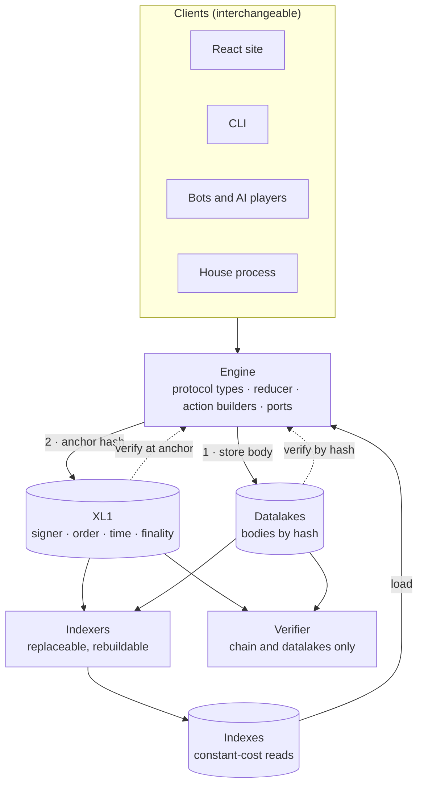

# dApp Architecture Principles

**Read when designing, reviewing or migrating any XL1 dApp whose state matters to more than one party**: games, markets, auctions, registries, leaderboards. This page says what the architecture must guarantee, whether or not the dApp adopts `@xyo-network/dapp-kit*`. The mechanics live elsewhere:

- The rest of this skill: the headless runtime, [application ports](application-ports.md), [effect journals](effects-and-recovery.md) and [hosting](hosting.md).
- [xl1-patterns](../xl1-patterns/SKILL.md): anchoring paths, [indexing](../xl1-patterns/chain-data-indexing-protocol.md), [commit-reveal](../xl1-patterns/commit-reveal.md) and the [dApp Definition of Done](../xl1-patterns/dapp-checklist.md).
- [xl1-knowledge](../xl1-knowledge/SKILL.md): the chain, gateways and datalakes.
- [Payload schema evolution](../xyo-knowledge/payload-schema-evolution.md): schema names, `$version` and root hashes.

**Maturity.** Principles 1–7 are owner direction. The elaboration, tables and examples were distilled from the Crypto Cards dApp and are still under review; the [open questions](#open-questions) are unsettled. Where a mechanism below depends on XL1 behavior that is not yet confirmed, the text says so.

## The model

An XL1 dApp is a protocol, not a website. Its state is a deterministic function
of signed payloads. Each payload's hash is anchored in a finalized XL1
transaction, which fixes its author, its position and its time. Each body sits
in one or more datalakes, which can withhold it but cannot alter it. Everything
else is replaceable machinery bound by the protocol: the engine that builds and
reads payloads, the house that moves a game forward, the indexers that make it
fast and the interfaces that make it usable.

Speed comes from indexes. Truth comes from the chain and the datalakes. Every
fast answer must be checkable against the truth, cheaply.

## Terms

| Term | Meaning on this page |
| --- | --- |
| Protocol | The written contract for the dApp's state data: schemas, authority, timing, ordering, derivation, failure handling and versioning. |
| Engine | The UI-agnostic implementation of the protocol: validation, state derivation and action construction, behind injected I/O ports. |
| Evidence | Anchored payloads plus their bodies. The only input to state. |
| Anchor | The finalized XL1 transaction that commits a payload hash, and the position `(block, transaction ordinal, payload ordinal)` it gives that payload. |
| Datalake | A content-addressed body store: each key is the hash of its value. |
| House | A protocol role: the account that signed and anchored the dApp's initialization payload. Named *house* rather than *host* because dapp-kit's *host* is the process, page or worker a runtime runs in. This page uses *host* only in that dapp-kit sense (see [Vocabulary](vocabulary.md)). |
| Index | Derived, published data for fast reads. Rebuildable, replaceable and never authoritative. Also called a projection. |
| Verifier | An implementation that derives state from evidence alone. |

## 1. The dApp is an engine; every interface is a client

> Everything that defines the dApp (its protocol types, validation, state
> derivation and action construction) lives in a headless engine with no UI
> dependency. A React site, a CLI, an AI agent, a test and the house process
> all drive that one engine, and none of them contains dApp logic.

**Why.** One implementation of the rules means the site, the CLI, the bots, the
indexer and the verifier cannot disagree. The whole dApp can be exercised
without a browser, and bots that play through the same path as people keep
that path under constant test. Interfaces can be added or replaced without
touching the protocol. On XL1, [dapp-kit](SKILL.md)
is the supported way to build the engine as a headless runtime.

**Practices.**

- Layer by dependency, in one direction only: the protocol (schemas, a pure
  reducer and conformance vectors, with no I/O), then the engine (ports plus a
  command and query surface), then the interfaces (site, CLI, bots, house
  process).
- Put every effect behind an injected port: chain reads, datalakes, the signer,
  local storage, and the clock, which is the chain's. The same engine then runs
  in Node, in the browser, on serverless targets and under test.
- Make signing a port that signs and does not broadcast. The engine prepares an
  action; a wallet, a CLI key or a bot key signs it. Keys never live in the
  interface layer.
- Journal each signed submission before broadcasting it, and resume from the
  journal without re-signing. Retry safety belongs to the engine, not to a UI.
- Expose typed commands, queries and status (dapp-kit application ports), not a
  bespoke REST API that quietly becomes the protocol.
- Interfaces present; the engine decides. A UI may format a phase, a score or
  an eligibility, but it never computes one, and no device- or
  viewport-specific branch changes behavior.

**Anti-patterns.** Rules in React hooks. A CLI that re-implements scoring for
convenience. A server whose request handlers are the real rules. A page that
holds keys.

## 2. State is evidence: bodies in datalakes, hashes anchored on XL1

> Every fact that affects the dApp's state is a signed payload whose hash is
> anchored in a finalized XL1 transaction and whose body is stored in one or
> more datalakes. Given the chain and the datalakes, and nothing else, anyone
> can recompute the complete state.

What each part establishes:

| Source | Establishes | Does not establish |
| --- | --- | --- |
| Transaction signer | Which key authored the payload | Personhood, honesty or consent |
| Anchor position | A total order over all evidence | That any content is true |
| The block's signed time payload | When, under chain consensus | — |
| Finality | That inclusion and order will not change | — |
| A body whose hash matches its anchor | That the body is exactly what was committed | That the body is still available |

**Practices.**

- Derive state with a pure function: `state = reduce(rules, finalizedBlocks, bodies)`.
  No network, wall clock, randomness, locale or floating point inside it. Fold
  whole finalized blocks, including empty ones, because deadlines pass in
  blocks that carry no dApp events.
- Store each body before, or with, its anchor, then read it back. The bytes in
  the datalake must be the bytes whose hash the transaction commits, so
  anything that re-serializes in transit must agree with the hashing rule.
  (See [Lessons](#lessons-from-practice): canonicalization drift.)
- Witness external inputs. A price, an outside score, any input from beyond the
  dApp is a signed, anchored payload from an identified publisher. State that
  depends on an unanchored input is not verifiable.
- Take randomness from evidence: a block hash fixed after the relevant
  commitments, or a commit-reveal between parties. Never an unrecorded random
  number.
- Keep secrets as commitments. Anchor the commitment now and the reveal later,
  and define what a missing reveal means (usually forfeit), so state is always
  decidable.
- Bind evidence to its network. Payloads and references carry the chain id and
  genesis hash, so evidence cannot be replayed on another network or across a
  fork.
- Where anchoring every item costs too much, batch with a hash chain. If each
  item names its predecessor's hash, anchoring every Nth item commits all the
  earlier ones, at the cost of coarser timing for the items in between.

## 3. A written protocol defines the state data

> The dApp's state data has a written, versioned protocol, and every
> implementation (engine, house, indexer, verifier, third-party client) obeys
> it. The code implements the protocol; it does not define it.

**Why.** Without a written protocol, the state is whatever the current build
computes, and history changes whenever the code does. Changing a reducer
without changing the rules a game pinned does not change that game; it
produces a faulty implementation.

**A protocol specifies:**

1. **Schemas.** Closed shapes in a stable namespace. Schema names carry no
   version numbers; `$version` carries the structure version. Validate name,
   supported version and shape together.
2. **Identity.** Content by root hash. Events by a full reference (chain id,
   genesis hash, transaction hash, payload ordinal and payload hash), because
   the same body can be anchored more than once.
3. **References.** Parents are typed fields covered by the payload hash, never
   `$sources` or other client metadata. The reference graph is acyclic.
4. **Authority.** Which signer may emit which payload, in which phase.
5. **Timing.** Windows in chain time, with explicit `[nbf, exp)` bounds.
6. **Ordering and conflicts.** The first valid payload in finalized order wins;
   duplicates and equivocation have defined outcomes.
7. **Derivation.** The reducer, in exact integer arithmetic.
8. **Failure.** Invalid input is rejected and reported. A missing body is
   unresolved, never absent. A missed action has a defined outcome.
9. **Versioning.** Each game's initialization payload pins its rules by hash,
   and the game keeps those rules forever. New rules mean a new declaration.
10. **Conformance vectors.** Golden inputs and outputs, so independent
    implementations converge on the same state.

**Design rules that keep a protocol verifiable.**

- **A payload never declares its own author or time.** The signer is the author
  and the block is the clock. Policy fields that say who *may* act, or by
  *when*, are fine. Provenance fields that claim who *did* act, or *when*, are
  not.
- **Bound every "first" and every "latest".** Rules such as "the first valid
  declaration wins" or "a later revision supersedes" are absence claims:
  checking them means proving that nothing earlier or later exists. Give each
  such rule a bounded window, a hash-linked sequence or a committed set
  (principle 7), so that checking it never means scanning all of history.
- **Make relevance decidable from the envelope.** If the reducer must fetch a
  body to learn whether a payload concerns this game at all, anyone can stall
  the game by anchoring a matching schema and withholding the body. Decide
  relevance from the signer (the house, admitted participants, authorized
  witnesses) and from chain-visible context.
- **Ship the protocol as its own package** of schemas, reducer and vectors,
  imported by the engine, the house process, the indexer and the verifier.

## 4. The house is a protocol role, bound by the protocol

> When a dApp needs a house (to open games, deal, commit its own moves, select
> oracle evidence or settle), the house is an account, not a server. It
> becomes the house by signing and anchoring an initialization payload that
> pins the rules, such as a Series declaration (a schedule of games and the
> rules they share) or a Session declaration (one game). From then on, each
> house action is a signed, anchored payload that the protocol validates like
> any other. The protocol may grant the house privileges; the house has no
> powers beyond them.

**Practices.**

- House identity is the signer of the initialization payload. There is no
  `house` field.
- The initialization payload pins everything validity depends on: the rules and
  verifier by hash; parameters such as schedule, windows, fees and deck; the
  network; and any third parties the house is bound to, such as oracle
  publishers. A verifier needs nothing else to judge the game.
- List the house's privileges in the protocol, each as an anchored action with
  a deadline.
- Constrain what the house could otherwise exploit. It commits seeds and its
  own moves before participants act, and reveals them afterwards. It selects
  external evidence by explicit, committed reference, so it cannot cherry-pick
  later.
- Define house failure. If the house misses a deadline, the protocol says what
  happens: a house forfeit, a missed occurrence, a void game. The house can
  stall a game; it cannot rewrite one.
- Change by declaration. New rules or parameters mean a new initialization
  payload; games already declared keep theirs.
- Run one signing process per house account, because two processes signing as
  one house fork its signature chain. Journal before signing and recover
  without re-signing: a signing intent without durable signed bytes is an
  uncertain state, not permission to sign again.
- Give nothing off-protocol any authority. Relays, fee sponsors, schedulers and
  index publishers can help the house run; none of them may decide formation
  or settlement.
- Let anyone be a house. Readers select a house by address and never substitute
  another house's game for a missing one.

The house process is a host like any other: one more client of the engine
(principle 1). The reducer that verifiers run is the one that tells the house
what to do next.

## 5. Load from indexes, not from replay

> Loading the dApp never requires replaying the chain and datalakes.
> Interfaces load from indexed data produced by indexers, or read the chain
> directly where the read costs the same however long the history. Full replay
> is for indexers and verifiers, not page loads.

**Why.** Replay cost grows with history. A dApp that replays to load is fast on
its first day and unusable on its hundredth.

**What "constant" means.** Independent of the chain's length and of the dApp's
history. The cost may grow with what is on screen: a page of eight games is
eight reads. The test is that a cold load costs the same on day one and on day
one thousand.

**Constant-cost reads on XL1 today:** a transaction by hash (with its bodies,
when a datalake is configured), the block containing a transaction, a block by
number, the finalized head and its signed time, and a body by hash from a
datalake. XL1's step indexes make range reads far cheaper than block-by-block
walks, but their cost still grows with the range, so they are bounded only
when the range is (a game's own window, for example).

**Missing today:** there is no lookup from a payload hash to the transaction
that carries it, so a bare payload hash means a search. Carry locators
instead: wherever an object or an index entry points at an event, use the full
event reference, including its transaction hash.

**Viewing versus acting.** Loading is viewing, and viewing may trust the index.
Acting (signing, sponsoring, settling) depends on facts that must actually
hold. Two defenses apply, together:

- Make those facts constant-cost to verify (principle 7), and verify them
  before signing.
- Make actions self-binding. An action names the exact game, house, rules and
  phase it assumes, so one built on a wrong view is harmlessly invalid rather
  than misdirected. Being misled by an index should cost no more than the
  attempt.

**Practices.**

- Separate discovery ("which games exist?") from verification ("is this game
  what the index says?"). Indexes supply locators; anchors supply truth.
- Report status honestly. *Indexed*, *verified at its anchor* and *unresolved*
  are different states, and *not in the index* never means *does not exist*.
- When the index is missing or corrupt, fall back to source discovery or show
  the evidence as unavailable. Never substitute a different object for the one
  requested.
- Cache finalized reads indefinitely. They never change.

## 6. Indexes answer in constant cost

> Indexes built for viewing answer each question the interface asks in a
> bounded number of reads that does not grow with history. Design them from
> the queries backward.

**Practices.**

- Key by the question: house to Series pages, Series to game pages, game to
  current state plus evidence locators, account to history pages. Use keys the
  client can compute, so a lookup is a fetch rather than a search.
- Page every unbounded set in fixed-size, append-only pages, newest first, with
  cursors that never repeat a row. Keep the active set apart from history, and
  bound how many pages a view needs.
- Scope by house and by Series, so one busy house does not slow another's
  reads.
- Maintain incrementally. Apply each finalized block once, in order, and never
  rebuild from the start on the hot path. Always keep the ability to rebuild
  from the declared floor into a fresh generation.
- Publish immutable generations under a small mutable head, writing the head
  last. Immutable objects can be cached forever; the head has bounded
  freshness.
- Index finalized blocks only. On a regression or a conflicting block hash,
  stop and republish from a verified checkpoint. Never extend, or silently
  rewrite, a published generation.
- Store evidence locators with every entry (principle 7).
- Publish public evidence only. Unrevealed secrets, keys, custody records and
  drafts never enter an index.
- Read ranges through XL1's step indexes rather than one block at a time.

**Anti-patterns.** One growing catalog file that every client downloads. "Find
the current game" implemented as a scan from the floor. An index that only its
original operator can rebuild.

## 7. Index answers are verifiable, cheaply

> Indexes are trusted to be fast, never to be right. Every index entry can be
> checked against the chain and datalakes, and the cheapest check should be
> constant-cost: read the anchor the entry names, fetch the body it names, and
> re-derive.

Claims differ in what checking them costs:

| Claim | Example | Cost to check from evidence |
| --- | --- | --- |
| Presence | "This Series exists, signed by H, pinning rules R" | Constant: inclusion, block, body. Three requests (about 0.7 s on Sequence, measured 2026-09-22) |
| Derived state | "Game G's standings are S" | G's own evidence: re-reduce G's block range. The work follows the game's duration, not the chain's age |
| Absence, completeness, uniqueness | "No other action exists", "this is the first", "this is the latest", "these are all the games" | Unbounded unless the protocol provides structure. A found item verifies; a zero is the indexer's word |

Making the third row tractable is a protocol job, not an index job. These
options combine:

1. **Bound it.** Give the rule a window, so the check is a scan of that window.
   XL1 transactions' own `nbf`/`exp` follow this pattern.
2. **Chain it.** Each item in a sequence names its predecessor's hash. History
   becomes a walk of that sequence alone, and a fork is detectable.
3. **Commit the set.** The responsible party anchors a digest of exactly the
   items that count, such as a house commitment that lists the observation
   references it selected. Membership becomes checkable, and an omission
   becomes a provable, attributable fault.
4. **Route it on chain.** Each action carries a dust transfer to an address
   derived from its object's hash
   ([Destination as Protocol](../xl1-patterns/chain-data-indexing-protocol.md#destination-as-protocol--a-native-xl1-pattern)),
   and the protocol makes that transfer a validity condition. Address-scoped
   history then returns exactly the object's transactions, at a cost that
   follows the object's activity, and names the object on chain even when a
   body is withheld. The address-history semantics need confirming before
   anything relies on this.
5. **Make it optimistic.** Presume validity from the constant-cost check, and
   let any anchored counter-evidence overturn it within a challenge window.
   This works when only the party who would profit from hiding the
   counter-evidence can create it.
6. **Use chain-authenticated summaries** where XL1 provides them. Today XL1's
   per-frame schema counts are its indexer's word, not consensus-signed
   evidence of absence.

**Practices.**

- Every entry carries its evidence: the event references it derives from, and
  the finalized head it was computed under.
- Verify before acting: check an action's preconditions at their anchors before
  signing, and bind them into the action.
- Index output never grants authority. It cannot enable signing or
  sponsorship, set participant counts, or report settlement without source
  checks.
- The verifier runs without the index. Verifying a known object must work while
  the official index is down.
- Consider signing index publications. An indexer that signs what it serves is
  accountable, and a signed false claim is portable proof of the fault.

## Cross-cutting rules

These follow from the principles and come up in every review.

- **The chain is the clock and the orderer.** Windows are defined in chain time
  (the block's signed time payload), order is finalized position, and local
  clocks are for display. Missing proof is not passing proof: a block with no
  clock counts as late.
- **The signer is the author.** Authorship is structural, carried by the bound
  witness, never by a payload field.
- **Every input is adversarial.** Anyone can anchor anything under your schema,
  and any datalake, gateway or index can return anything. Validate everything;
  reject and report invalid input rather than dropping it silently; make sure
  invalid or withheld input cannot freeze or redirect state.
- **Integrity is not availability.** Content addressing makes substitution
  detectable, not withholding. "Could not fetch" never means "did not happen":
  unresolved evidence is a first-class state, bodies are replicated, and the
  protocol says what an unresolvable input blocks.
- **Claim only what you checked.** Every status names the evidence behind it.
  Local, testnet and production results are reported separately, and checking
  an index view is never reported as verification.

## Trust at a glance

| Component | Trusted for | Not trusted for | Kept honest by |
| --- | --- | --- | --- |
| XL1, read through a gateway | Inclusion, order, signer, time, finality | The meaning or truth of content; body availability | Consensus, and the gateway you choose to trust (re-verify signatures when reading through one you do not) |
| Datalakes | Serving bodies | Integrity | Rehashing each body against its anchor |
| The house | Liveness: moving the game forward | Anything the protocol does not grant | Anchoring and verifying every house action |
| Oracles and witnesses | Attribution of what they signed | Economic truth | Identified publishers, quorum and published policy |
| Indexers | Speed and discovery | Correctness and completeness | Constant-cost checks, replaceability, rebuild from the floor |
| Interfaces | Presentation | Everything else | Going through the engine |

## Where each question is answered

| Question | Answered from | Cost |
| --- | --- | --- |
| Does event E exist? Who signed it, and when? | The chain, by E's transaction hash | Constant |
| What is E's body? | A datalake, by hash | Constant |
| What time is it? | The finalized head and its time payload | Constant |
| Which games does house H run? | Index pages | Per page shown |
| What is game G's state? | The index, to load; G's own range, to verify | Constant; G's duration |
| Is this every relevant action in G? | Protocol structure: a bounded window, a committed set or an on-chain route | Bounded, never the whole history |
| What is the whole dApp's state? | Indexer or verifier replay from the floor | The whole history, offline only |

## Review questions

Ask these of any new XL1 dApp design, and answer them in the design doc or completion summary.

1. Can the site, the CLI and a bot each perform every action through the same
   engine?
2. Which command recomputes a game's state from the chain and datalakes alone?
3. Where is the protocol written, and which hash pins it in each game?
4. What can the house do, what can it not do, and what happens if it vanishes
   mid-game?
5. How many reads does a cold load take on day one? On day one thousand?
6. For any index entry, which few reads verify it?
7. Which rules need an absence check, and what bounds each one?
8. What happens when a body is withheld? When a stranger anchors junk under
   your schema?
9. Where do time and randomness come from?
10. What does each action assume, and does it bind those assumptions?

## Lessons from practice

These rules were shaped by the Crypto Cards dApp, which was built to the principles above. Its failures are instructive:

- **Self-declared provenance.** An observation once carried a `publisher` field that the verifier checked against policy while the real signer went unchecked, so anyone able to publish could claim to be the witness. Hence *the signer is the author*.
- **Canonicalization drift.** A transport that re-serialized nested arrays archived bodies under hashes no transaction committed, and reveals became unresolvable at settlement. Hence *store the committed bytes and read them back*: read-back catches this at write time.
- **Serialized reads.** A cold load took about 19 s on a beta network because body reads resolved one at a time. Batching those reads brought it to about 6 s. The remainder was a history scan needed to check "first valid" and "latest revision" rules, which are absence claims, and it grows with every block. Hence *measure day one against day one thousand*, and *bound every "first" and every "latest"*.
- **Unbounded completeness.** Settling a round from its own block range keeps the work proportional to the round, but any withheld action body in that range blocks settlement. Hence *make relevance decidable from the envelope* and give absence checks protocol structure (principle 7).

## Open questions

1. **A default for absence.** Should principle 7 name one recommended mechanism (committed sets or on-chain routing), or keep the list of options?
2. **Acting on index data.** Is "actions bind their assumptions, so being misled costs at most the attempt" the rule, or must every precondition of an action be verified at its source before signing?
3. **Asks of XL1.** A lookup from payload hash to transaction; consensus-authenticated per-frame schema summaries, which would make absence provable; and confirmed address-history semantics for on-chain routing.

Until these are settled, prefer the stricter reading: verify preconditions at their source before signing, and choose a committed set or a bounded window over routing that relies on unconfirmed address-history semantics.
